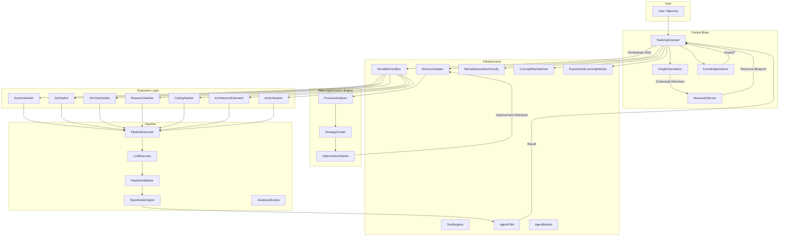
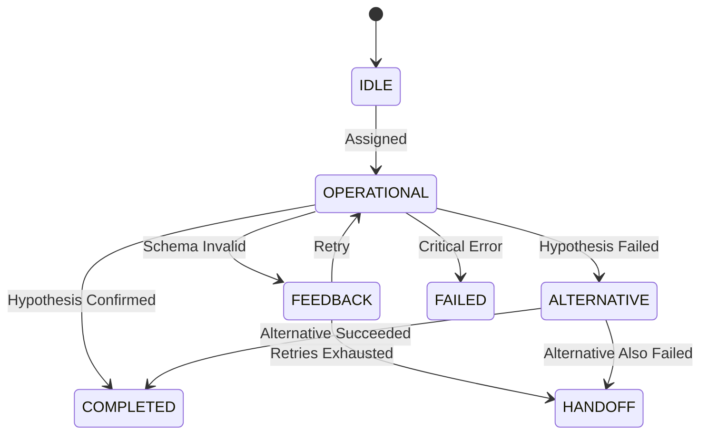
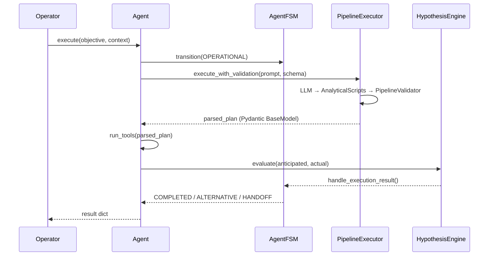
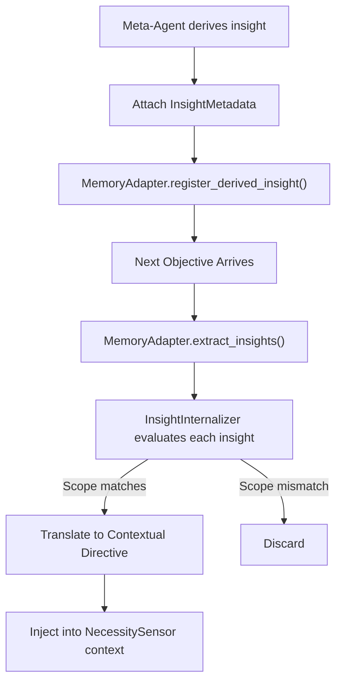

# 🧠 AGENTIC SWARM — ARCHITECTURAL BLUEPRINT

> **Version**: 1.0 — February 2026
> **Codename**: *Seeker Swarm*
> **Status**: Structural MVP Complete. Pre-Production.

---

## Table of Contents

1. [System Overview](#1-system-overview)
2. [High-Level Architecture Diagram](#2-high-level-architecture-diagram)
3. [Core Engine (`core/`)](#3-core-engine)
4. [Agent Layer (`agents/`)](#4-agent-layer)
5. [Execution Pipeline (`pipeline/`)](#5-execution-pipeline)
6. [Vector Store & Semantic Routing (`vector_store/`)](#6-vector-store--semantic-routing)
7. [Data Flow: End-to-End Orchestration](#7-data-flow-end-to-end-orchestration)
8. [Meta-Optimization Engine](#8-meta-optimization-engine)
9. [Insight Lifecycle](#9-insight-lifecycle)
10. [Schemas & Data Contracts](#10-schemas--data-contracts)
11. [Production Roadmap](#11-production-roadmap)

---

## 1. System Overview

The Agentic Swarm is a **self-improving, multi-agent orchestration framework** designed to function as a digital cognitive proxy. It is not a chatbot. It is an autonomous execution engine that:

- **Plans** before it acts (Necessity Sensor pre-computes resource blueprints)
- **Executes** through specialized Seeker Agents, each with strict Pydantic-enforced output schemas
- **Validates** every output against a Hypothesis Engine (anticipated vs. actual)
- **Learns** from its own execution history, deriving multi-dimensional insights
- **Optimizes** itself by grading alternative strategies and rewriting its own agent prompts

### Core Design Principles

| Principle | Implementation |
|---|---|
| **Schema-First** | Every agent output is a Pydantic `BaseModel`. No free-form text survives the pipeline. |
| **Finite State Machines** | Every agent has an explicit FSM (`IDLE → OPERATIONAL → FEEDBACK → ALTERNATIVE → HANDOFF → COMPLETED/FAILED`). |
| **Durable Execution** | Tasks are serializable, pausable, and resumable via the `DurableEventBus`. Cron schedules are natively supported. |
| **Hypothesis-Driven** | Agents declare what they *expect* to happen. The `HypothesisEngine` compares this against reality. |
| **Self-Improvement** | Meta-agents audit, grade, and optimize operational agents. Derived insights are indexed and exploited. |
| **Immunity System** | The `ConceptStandardizer` maps chaotic errors to a strict taxonomy, triggering isolation protocols. |

---

## 2. High-Level Architecture Diagram


<details>
<summary>Mermaid Source</summary>



</details>

---

## 3. Core Engine

The `core/` directory contains the brain, memory, and lifecycle infrastructure of the Swarm.

### 3.1 SeekingOperator — [`core/operator.py`](file:///C:/Users/shrey/Downloads/SWARM/agentic_swarm/core/operator.py)

The **Central Executive Brain**. It is the only entry point for user objectives.

| Responsibility | Method |
|---|---|
| Dynamic Planning (which agent to call next) | `determine_next_step()` |
| Full DAG Orchestration Loop | `orchestrate()` |
| Pre-Flight Necessity Scan | Calls `NecessitySensor` before execution |
| Exploitation Check | Queries `KnowledgeIndexer` for proven strategies |
| Insight Internalization | Routes raw insights through `InsightInternalizer` |
| Durable Task Lifecycle | Enqueues/completes tasks via `DurableEventBus` |
| State Logging | Records every delegation to `MemoryAdapter.ledger` |

**Key Schemas:**
- `OperatorPlanSchema`: `selected_agent`, `sub_objective`, `reasoning`

**Orchestration Loop (Pseudocode):**
```
1. Check KnowledgeIndexer for exploitable strategy
2. If none → Extract raw insights from Memory
3. Route insights through InsightInternalizer
4. Feed contextual directives to NecessitySensor
5. NecessitySensor returns Resource Blueprint
6. WHILE steps < max_steps:
     a. determine_next_step() via LLM + MentalAssociation
     b. event_bus.enqueue_task()
     c. Agent.execute() → FSM lifecycle
     d. event_bus.complete_task()
     e. Log to Memory Ledger
     f. ExperientialLearning.internalize()
```

---

### 3.2 MemoryAdapter — [`core/memory.py`](file:///C:/Users/shrey/Downloads/SWARM/agentic_swarm/core/memory.py)

Three-tier cognitive memory system.

| Tier | Storage | Purpose |
|---|---|---|
| **Short-Term (Scratchpad)** | `Dict[str, Any]` | Key-value working memory for the current session |
| **Long-Term (Ledger)** | `List[Dict]` | Immutable, append-only execution trace log |
| **Subconscious** | Ideas, Bottlenecks, Derived Insights, Process IPs | Meta-cognitive pools for self-improvement |

**Key Schemas:**
- `IdeaOrBottleneck` — Asynchronous thoughts from agents
- `InsightMetadata` — Multi-dimensional tags (`povs`, `metrics`, `scopes`, `scales`, `likelihood`, `mood_emotion`, `intent`)
- `DerivedInsight` — Concrete rules with rich metadata, sourced from meta-agents
- `ProcessIP` — Isolated, repeatable execution sequences (path functions + cost + success rate)

**Key Methods:**
- `save_state()` / `get_state()` — Scratchpad CRUD
- `log_execution()` — Appends to immutable ledger
- `register_subconscious_thought()` — Ideas and bottleneck flagging
- `internalize_process_ip()` — Saves a proven path function
- `register_derived_insight()` — Stores insights with multi-dimensional metadata
- `extract_insights()` — Retrieves relevant insights for a given objective

---

### 3.3 AgentFSM — [`core/fsm.py`](file:///C:/Users/shrey/Downloads/SWARM/agentic_swarm/core/fsm.py)

Non-Deterministic Finite State Machine embedded in every agent.


<details>
<summary>Mermaid Source</summary>



</details>

**States:** `IDLE`, `OPERATIONAL`, `FEEDBACK_PROCESSING`, `ALTERNATIVE_DECISION`, `HANDOFF`, `COMPLETED`, `FAILED`

---

### 3.4 DurableEventBus — [`core/event_bus.py`](file:///C:/Users/shrey/Downloads/SWARM/agentic_swarm/core/event_bus.py)

Manages the lifecycle of pausable, interruptible, and cron-scheduled tasks.

| Method | Function |
|---|---|
| `enqueue_task()` | Schedules a new one-off or cron task |
| `pause_task()` | Serializes agent state snapshot to memory |
| `resume_task()` | Hydrates a paused task from its snapshot |
| `complete_task()` | Marks done, or resets to `PENDING` if cron |

**Task Statuses:** `PENDING`, `RUNNING`, `PAUSED`, `COMPLETED`, `FAILED`, `INTERRUPTED`

---

### 3.5 ToolRegistry — [`core/tool_registry.py`](file:///C:/Users/shrey/Downloads/SWARM/agentic_swarm/core/tool_registry.py)

Global catalog of available software, APIs, and custom scripts.

Each `RegisteredTool` includes:
- **`purpose`**: What problem does it solve?
- **`how_to`**: Exact mechanical syntax
- **`when_to`**: Heuristic on optimal usage
- **`dependencies`**: Required packages

Seeded with `curl` and `pytest`. Dynamically extended by `ActionSeeker` when it creates new scripts.

---

### 3.6 KnowledgeIndexer — [`core/knowledge_indexer.py`](file:///C:/Users/shrey/Downloads/SWARM/agentic_swarm/core/knowledge_indexer.py)

The **Librarian of Exploitation**. Stores fully graded, optimized strategies.

- `capture_and_index()` — Saves a winning strategy (DAG + tools + grade)
- `exploit_strategy()` — Searches index for a matching proven pattern

Checked **before** the Necessity Sensor runs. If a match is found, the Swarm skips planning entirely and exploits the known-good path.

---

### 3.7 ExperientialLearningModule — [`core/experiential_learning.py`](file:///C:/Users/shrey/Downloads/SWARM/agentic_swarm/core/experiential_learning.py)

Scans the execution ledger to extract successful path functions and package them into reusable `ProcessIP`s.

- `internalize_successful_sequence()` — Extracts and isolates a proven DAG
- `factor_constraints()` — Cost/budget analysis before replaying a Process IP

---

### 3.8 ConceptStandardizer — [`core/concept_standardizer.py`](file:///C:/Users/shrey/Downloads/SWARM/agentic_swarm/core/concept_standardizer.py)

The **Immunity System**. Maps chaotic environmental outputs to a strict taxonomy.

| Raw Signal | Standardized Concept | Protocol |
|---|---|---|
| `error`, `exception` | `Immunity_Threat:Execution_Anomaly` | Isolate agent; Request QASeeker triage |
| `timeout` | `Immunity_Threat:Resource_Exhaustion` | Pause process; DevOpsSeeker assessment |
| `unauthorized` | `Immunity_Threat:Access_Violation` | Halt execution; Request HITL override |
| `repetitive` | `Bottleneck:Purposeless_Loop` | Terminate loop; Re-evaluate Idea Pool |

---

### 3.9 AgentBuilder — [`core/agent_builder.py`](file:///C:/Users/shrey/Downloads/SWARM/agentic_swarm/core/agent_builder.py)

Dynamic A/B testing for agent versions. Registers multiple versions of the same capability and routes via random split distribution.

---

## 4. Agent Layer

All agents inherit from `BaseSeekerAgent`. Each agent defines:
1. A **System Prompt** (persona/instructions)
2. A **Pydantic Output Schema** (strict JSON contract)
3. A **`run_tools()` method** (actual execution logic)

### 4.1 Operational Agents

| Agent | File | Role | Output Schema |
|---|---|---|---|
| **SystemSeeker** | `agents/system_seeker.py` | OS-level terminal commands | `SystemCommandSchema` |
| **QASeeker** | `agents/qa_seeker.py` | Unit test writing and validation | `QASchema` |
| **DevOpsSeeker** | `agents/devops_seeker.py` | Infrastructure, CI/CD, deployments | `DevOpsSchema` |
| **ResearchSeeker** | `agents/research_seeker.py` | Internet research, documentation lookup | `ResearchSchema` |
| **CodingSeeker** | `agents/coding_seeker.py` | Code generation and refactoring | `CodingSchema` |
| **ArchitectureEstimator** | `agents/architecture_estimator.py` | Hardware/software architecture estimation | `ArchEstimateSchema` |
| **ActionSeeker** | `agents/action_seeker.py` | Script creation, execution, tool registration | `ActionSchema` |

### 4.2 Strategic Agents

| Agent | File | Role | Output Schema |
|---|---|---|---|
| **NecessitySensor** | `agents/necessity_sensor.py` | Pre-flight resource planning (Pre-Frontal Cortex) | `ResourceBlueprintSchema` |
| **InsightInternalizer** | `agents/insight_internalizer.py` | Contextual applicability filtering for derived insights | `InternalizationSchema` |

### 4.3 Meta-Optimization Agents

| Agent | File | Role | Output Schema |
|---|---|---|---|
| **ProcessAnalyzer** | `agents/process_analyzer.py` | Audits execution ledger for bottlenecks | `ProcessAuditSchema` |
| **StrategyGrader** | `agents/strategy_grader.py` | A/B grades alternative execution strategies | `StrategyGradingSchema` |
| **OptimizationSeeker** | `agents/optimization_seeker.py` | Formulates concrete improvement directives | `OptimizationPlanSchema` |

### 4.4 Agent Lifecycle (via `BaseSeekerAgent.execute()`)


<details>
<summary>Mermaid Source</summary>



</details>

---

## 5. Execution Pipeline

The `pipeline/` directory enforces strict validation and feedback loops.

### 5.1 LLMExecutor — [`pipeline/executor.py`](file:///C:/Users/shrey/Downloads/SWARM/agentic_swarm/pipeline/executor.py)

Handles raw communication with the OpenAI API. Supports `response_format: json_object`.

### 5.2 PipelineExecutor — [`pipeline/executor.py`](file:///C:/Users/shrey/Downloads/SWARM/agentic_swarm/pipeline/executor.py)

The validation loop coordinator:

```
FOR attempt IN range(max_retries):
  1. LLMExecutor.generate_response()
  2. AnalyticalScripts.run_regex_enforcement()  ← Pre-JSON mechanical checks
  3. PipelineValidator.validate_json_output()   ← Pydantic schema enforcement
  IF failure:
    Append error feedback to prompt (Feedback Processing Mode)
  IF max_retries exceeded:
    Raise HITL_REQUIRED
```

### 5.3 PipelineValidator — [`pipeline/validators.py`](file:///C:/Users/shrey/Downloads/SWARM/agentic_swarm/pipeline/validators.py)

Strips markdown code fences, parses JSON, validates against Pydantic schema. Returns structured `ValueError` messages for feedback loops.

### 5.4 HypothesisEngine — [`pipeline/hypothesis_engine.py`](file:///C:/Users/shrey/Downloads/SWARM/agentic_swarm/pipeline/hypothesis_engine.py)

Compares the agent's `anticipated_result` field against the actual execution output. Uses keyword overlap in MVP; designed for LLM semantic diffing in production.

### 5.5 AnalyticalScripts — [`pipeline/analytical_scripts.py`](file:///C:/Users/shrey/Downloads/SWARM/agentic_swarm/pipeline/analytical_scripts.py)

Pre-JSON mechanical enforcement layer. Runs regex and word-detection rules on raw LLM output before it enters the JSON parser.

---

## 6. Vector Store & Semantic Routing

### MentalAssociationFaculty — [`vector_store/mental_association.py`](file:///C:/Users/shrey/Downloads/SWARM/agentic_swarm/vector_store/mental_association.py)

Replaces hardcoded agent routing with **cosine similarity** over pseudo-embeddings.

**Embedding Dimensions:** `[Code_Focus, SysAdmin_Focus, Research_Focus, Architect_Focus]`

Each agent has a pre-seeded 4D vector. Objectives are converted to the same space via keyword bagging. The agent with the highest cosine similarity is selected.

> **Production upgrade:** Replace pseudo-embeddings with `litellm.embedding()` and MeiliSearch for real semantic vector search.

---

## 7. Data Flow: End-to-End Orchestration

```mermaid
flowchart LR
    A["User Objective"] --> B["KnowledgeIndexer: Exploit?"]
    B -->|"Yes"| C["Skip Planning, Use Proven DAG"]
    B -->|"No"| D["Memory: Extract Raw Insights"]
    D --> E["InsightInternalizer: Filter by Scope/Mood/Intent"]
    E --> F["NecessitySensor: Build Resource Blueprint"]
    F --> G["Operator: Orchestrate DAG Loop"]
    G --> H["EventBus: Enqueue Task"]
    H --> I["Agent: Execute via Pipeline"]
    I --> J["FSM: State Transition"]
    J --> K["Memory: Log to Ledger"]
    K --> L["ExperientialLearning: Internalize IP"]
    L --> M["ProcessAnalyzer: Audit"]
    M --> N["StrategyGrader: Grade Alternatives"]
    N --> O["OptimizationSeeker: Improve"]
    O --> P["Memory: Store DerivedInsight"]
    P --> Q["KnowledgeIndexer: Capture Strategy"]
    Q -.->|"Next Run"| B
```


<details>
<summary>Mermaid Source</summary>



</details>

---

## 8. Meta-Optimization Engine

The self-improvement loop that runs *after* operational execution.

### Sequence:
1. **ProcessAnalyzer** reads the execution ledger and flags bottlenecks, error patterns, and sub-optimal paths. Extracts `DerivedInsight`s with multi-dimensional metadata.
2. **StrategyGrader** evaluates alternative approaches and assigns grades (Time Score, Reliability Score, Resource Weight Score → Overall Grade A+ through F).
3. **OptimizationSeeker** takes the grades and formulates concrete `ImprovementDirective`s targeting agent prompts, custom scripts, or tool registry heuristics.
4. **KnowledgeIndexer** captures the winning strategy so it's exploited on future runs.

### Improvement Directive Types:
| Target Type | Example |
|---|---|
| `AGENT_PERSONA` | Rewrite SystemSeeker's system prompt to avoid redundant `ls` calls |
| `CUSTOM_SCRIPT` | Refactor the data parsing script for 3× speed |
| `TOOL_REGISTRY` | Update `when_to` heuristic for `curl` to prefer `httpx` for async |

---

## 9. Insight Lifecycle

Every derived insight carries **multi-dimensional metadata** to prevent context collapse.

### InsightMetadata Schema:

| Field | Type | Purpose |
|---|---|---|
| `povs` | `List[str]` | Points of view / perspectives |
| `metrics` | `List[str]` | What was measured |
| `scopes` | `List[str]` | Operational, temporal, or systemic boundaries |
| `scales` | `str` | Orders of magnitude (Micro, Macro, etc.) |
| `likelihood` | `str` | Probability assessment |
| `mood_emotion` | `str` | Aggressive, Cautious, Exploratory, etc. |
| `intent` | `str` | Why the insight was derived |

### Internalization Flow:


<details>
<summary>Mermaid Source</summary>



</details>

---

## 10. Schemas & Data Contracts

### Resource Blueprint (NecessitySensor Output)

```json
{
  "existing_tools_to_use": ["curl", "pytest"],
  "new_tools_to_create": ["custom_api_scraper"],
  "existing_agents_to_use": ["CodingSeeker", "QASeeker"],
  "new_agents_to_create": ["DataPipelineSeeker"],
  "dependency_graph": [
    {"step": "1", "agent": "CodingSeeker", "task": "Write scraper"},
    {"step": "2", "agent": "QASeeker", "task": "Test scraper"}
  ],
  "creation_reasoning": "No existing tool handles pagination for this API.",
  "estimated_time_seconds": 120,
  "computational_weight": "Medium",
  "anticipated_result": "Functional scraper registered in ToolRegistry."
}
```

### Durable Task (EventBus)

```json
{
  "task_id": "uuid",
  "objective": "Run daily health check",
  "target_agent": "DevOpsSeeker",
  "status": "PENDING",
  "state_snapshot": {},
  "cron_schedule": "0 8 * * *"
}
```

### Derived Insight (with Metadata)

```json
{
  "id": "uuid",
  "topic": "API Parsing",
  "insight": "Always use BS4 over Regex for HTML parsing.",
  "source_agent": "ProcessAnalyzer",
  "metadata": {
    "povs": ["Reliability", "Maintainability"],
    "metrics": ["Error Rate", "Parse Time"],
    "scopes": ["Web Scraping"],
    "scales": "Macro",
    "likelihood": "High",
    "mood_emotion": "Cautious",
    "intent": "Reduce parsing failures in production scrapers."
  }
}
```

---

## 11. Production Roadmap

### Phase 1: Live LLM Integration
- [ ] Connect `LLMExecutor` to real OpenAI/LiteLLM API keys
- [ ] Build a CLI entry point for terminal-based interaction

### Phase 2: Persistent Storage
- [ ] Replace in-memory `MemoryAdapter` with PostgreSQL/Firestore
- [ ] Replace keyword matching in `extract_insights()` with MeiliSearch vector similarity
- [ ] Replace pseudo-embeddings in `MentalAssociationFaculty` with `litellm.embedding()`

### Phase 3: Durable Execution
- [ ] Back `DurableEventBus` with Celery/Temporal.io for true pause/resume
- [ ] Implement real cron scheduling via APScheduler or Celery Beat

### Phase 4: Dashboard
- [ ] Build a real-time monitoring UI (WebSocket + React)
- [ ] Visualize FSM state transitions, DAG execution, and insight lifecycle

### Phase 5: Agent Autonomy
- [ ] Enable `OptimizationSeeker` to hot-swap agent system prompts at runtime
- [ ] Enable `ActionSeeker` to auto-register newly created scripts in `ToolRegistry`
- [ ] Enable `AgentBuilder` to dynamically spawn entirely new agent personas via LLM

---

## File Index

| File | Module | Lines | Purpose |
|---|---|---|---|
| `core/operator.py` | Core | 214 | Central Executive Brain |
| `core/memory.py` | Core | 134 | Three-tier Memory System |
| `core/fsm.py` | Core | 57 | Agent Finite State Machine |
| `core/event_bus.py` | Core | 86 | Durable Task Lifecycle |
| `core/tool_registry.py` | Core | 61 | Software/API Catalog |
| `core/knowledge_indexer.py` | Core | 39 | Strategy Exploitation Library |
| `core/experiential_learning.py` | Core | 74 | Process IP Internalization |
| `core/concept_standardizer.py` | Core | 62 | Immunity System |
| `core/agent_builder.py` | Core | 41 | A/B Testing Agent Versions |
| `agents/base.py` | Agents | 103 | Abstract Base Agent |
| `agents/system_seeker.py` | Agents | — | OS Terminal Commands |
| `agents/qa_seeker.py` | Agents | — | Unit Testing |
| `agents/devops_seeker.py` | Agents | — | Infrastructure |
| `agents/research_seeker.py` | Agents | — | Internet Research |
| `agents/coding_seeker.py` | Agents | — | Code Generation |
| `agents/architecture_estimator.py` | Agents | — | Architecture Planning |
| `agents/action_seeker.py` | Agents | — | Script Creation & Execution |
| `agents/necessity_sensor.py` | Agents | — | Pre-Flight Resource Planning |
| `agents/insight_internalizer.py` | Agents | — | Insight Contextual Filtering |
| `agents/process_analyzer.py` | Agents | — | Execution Auditing |
| `agents/strategy_grader.py` | Agents | — | A/B Strategy Grading |
| `agents/optimization_seeker.py` | Agents | — | Performance Improvement |
| `pipeline/executor.py` | Pipeline | 108 | LLM + Validation Loop |
| `pipeline/validators.py` | Pipeline | 49 | Pydantic Schema Enforcement |
| `pipeline/hypothesis_engine.py` | Pipeline | 36 | Anticipated vs. Actual |
| `pipeline/analytical_scripts.py` | Pipeline | — | Regex Pre-Enforcement |
| `vector_store/mental_association.py` | Vector | 79 | Semantic Agent Routing |
| `tests/test_swarm.py` | Tests | — | Integration Test Suite |

---

> *"The Swarm does not react. It researches, plans, executes, validates, learns, and optimizes — in that order, every single time."*
